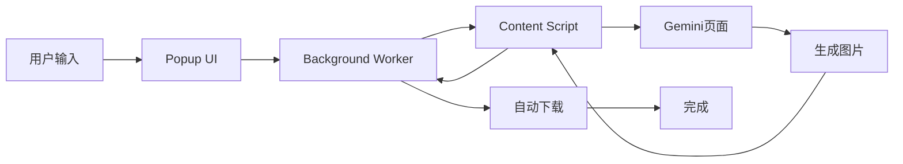

# 🥖 Gemini Auto PPT Generator

一个强大的Chrome浏览器插件，帮助您在Gemini页面上批量生成图片，自动使用"Nano Banana Pro"模型，并自动下载保存。


## ✨ 功能特性

- 🎨 **批量生图**：一次输入多个提示词，自动逐个生成图片
- 🤖 **智能模型选择**：自动使用Nano Banana Pro模型
- 📥 **自动下载**：生成的图片自动下载并按序命名（page1.png, page2.png...）
- 📊 **实时进度**：直观的进度条显示当前生成状态
- 💾 **智能保存**：自动保存上次输入的提示词
- 🎯 **简单易用**：现代化UI设计，操作直观

## [1.1.6] - 2025-12-05

### 🚀 最新更新
- 优化了图片下载逻辑，提升下载成功率
- 修复了部分情况下进度条显示不准确的问题
- 增加了错误提示，用户体验更友好

## 📦 安装步骤

### 方法一：开发者模式加载（推荐）

1. **下载插件文件**
   - 下载本项目的所有文件到本地文件夹

2. **打开Chrome扩展程序页面**
   - 在Chrome浏览器地址栏输入：`chrome://extensions/`
   - 或者点击：菜单 → 更多工具 → 扩展程序

3. **启用开发者模式**
   - 在页面右上角，打开"开发者模式"开关

4. **加载插件**
   - 点击"加载已解压的扩展程序"
   - 选择插件文件所在的文件夹
   - 点击"选择"

5. **完成！**
   - 插件图标会出现在Chrome工具栏
   - 如果没有看到，点击拼图图标📌固定插件

### 方法二：Chrome Web Store（未来）

> 插件正在准备提交到Chrome Web Store，敬请期待！

## 🚀 使用教程

### 第一步：打开Gemini页面

1. 访问 [https://gemini.google.com/app](https://gemini.google.com/app)
2. 确保已登录您的Google账号

### 第二步：准备提示词

在插件输入框中，每行输入一个提示词，例如：

```
一只可爱的猫咪坐在窗边
一只金毛犬在公园玩耍
一朵盛开的玫瑰花
```

### 第三步：开始生成

1. 点击插件图标打开界面
2. 在输入框中粘贴或输入提示词（每行一个）
3. 点击"🎨 开始生成"按钮
4. 等待自动生成和下载

### 第四步：查看结果

- 生成的图片会自动下载到您的默认下载文件夹
- 文件命名格式：`page1.png`, `page2.png`, `page3.png`...
- 进度条会实时显示生成进度

## 📸 使用截图

### 插件界面


### 生成过程
- 输入提示词 → 自动生成 → 自动下载 → 完成！

## ⚙️ 技术架构

### 核心技术栈
- **Manifest V3**：Chrome最新扩展标准
- **Content Script**：DOM操作和页面交互
- **Service Worker**：后台任务管理
- **Chrome APIs**：Downloads API、Storage API

### 工作流程



### 关键特性

1. **智能图片检测**
   - 使用MutationObserver监听DOM变化
   - 检测``元素
   - 验证图片URL有效性

2. **鉴权下载**
   - Content Script中使用fetch API
   - 自动携带浏览器Cookie和认证信息
   - 转换为Data URL后下载

3. **任务队列管理**
   - 顺序执行，确保每张图片完成后再生成下一张
   - 自动重试机制
   - 错误处理和用户提示

## 🔧 常见问题

### Q: 插件无法找到输入框？
**A:** 请确保：
- 您在 `https://gemini.google.com/app` 页面
- 页面已完全加载
- 尝试刷新页面后重试

### Q: 图片生成超时？
**A:** 
- 默认超时时间为90秒
- 如果网络较慢，可能需要等待更长时间
- 建议检查网络连接

### Q: 下载的文件在哪里？
**A:** 
- 图片会保存到Chrome默认下载文件夹
- 通常是：`~/Downloads/` 或 `C:\Users\用户名\Downloads\`
- 可以在Chrome设置中修改下载位置

### Q: 可以自定义文件名吗？
**A:** 
- 当前版本固定为 `page1.png`, `page2.png`...
- 未来版本将支持自定义前缀

### Q: 支持其他模型吗？
**A:** 
- 当前版本专为Nano Banana Pro优化
- 未来版本将支持模型选择

## 🛠️ 开发说明

### 项目结构

```
4.Nano Banana Pro Plugging/
├── manifest.json          # 插件配置文件
├── popup.html            # 弹窗界面
├── popup.css             # 界面样式
├── popup.js              # 弹窗逻辑
├── content.js            # 内容脚本（核心）
├── background.js         # 后台服务
├── icons/                # 图标资源
│   ├── icon16.png
│   ├── icon48.png
│   └── icon128.png
├── README.md             # 本文件
└── VERSION.md            # 版本历史
```

### 本地开发

1. 克隆项目
2. 修改代码
3. 在`chrome://extensions/`点击"重新加载"
4. 测试功能

### 调试技巧

- **Popup调试**：右键点击插件图标 → 检查弹出内容
- **Content Script调试**：在Gemini页面按F12 → Console查看日志
- **Background调试**：在`chrome://extensions/`点击"Service Worker"

## 📝 更新日志

查看 [VERSION.md](VERSION.md) 了解详细的版本历史。

## 🤝 贡献指南

欢迎提交Issue和Pull Request！

## 📄 许可证

MIT License

## 👨‍💻 作者

开发者：GT  
项目地址：[GitHub](https://github.com/yourusername/gemini-auto-ppt-generator)

## 🙏 致谢

- 感谢Google Gemini团队提供强大的AI能力
- 感谢所有使用和反馈的用户

---

**享受批量生图的乐趣！** 🎉
